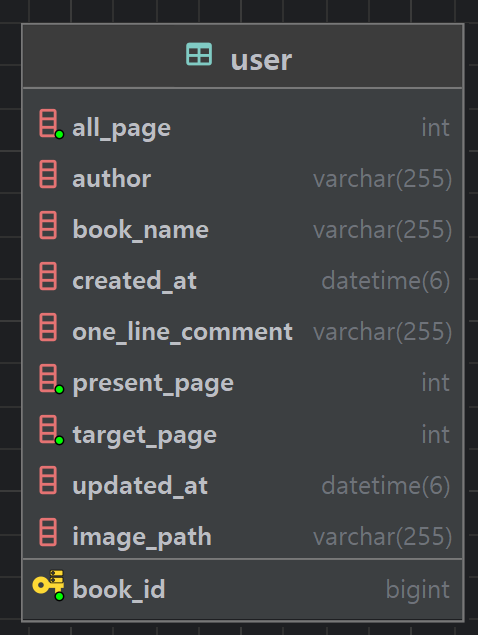
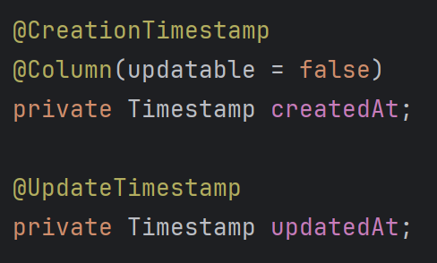
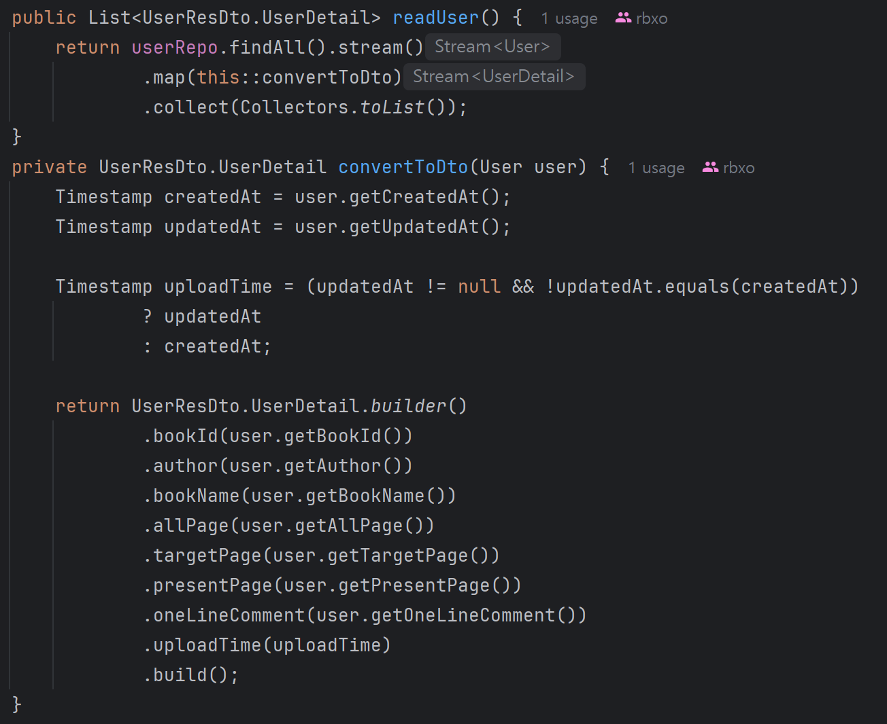
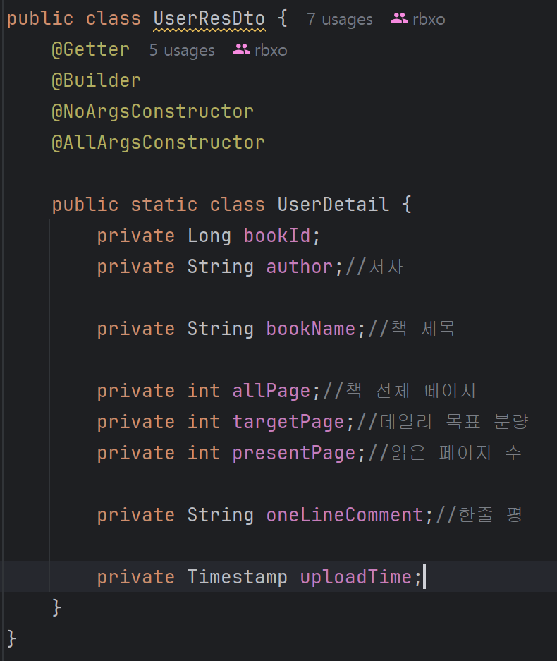

# 간장해보렸다...
---

### 우선 나의 zochol하지만 compact한 **ERD**

---
### api 명세서 notion link
https://www.notion.so/api-1f3c39548ac78072961ed991f30d7bc5?pvs=4

---

### back - end
https://github.com/5th-PARD-SERVER-PART/short_kyutae

---

### Swagger
http://172.17.198.240:8080/swagger-ui/index.html#

---

### 클백 연결표

---

---

### 기본적인 crud 구조 이외의 코드

---

### entity
기존에 했던 생성시간에서 수정시간을 추가로 구현함

---

### service

---

### UserResDto

---

구현 다 해 놓고.. git 망가져서 거의 3시간 동안 git 고치다가 결국 다시 만듦..
git 공부의 중요성을 이렇게 다시 배웁니다..

